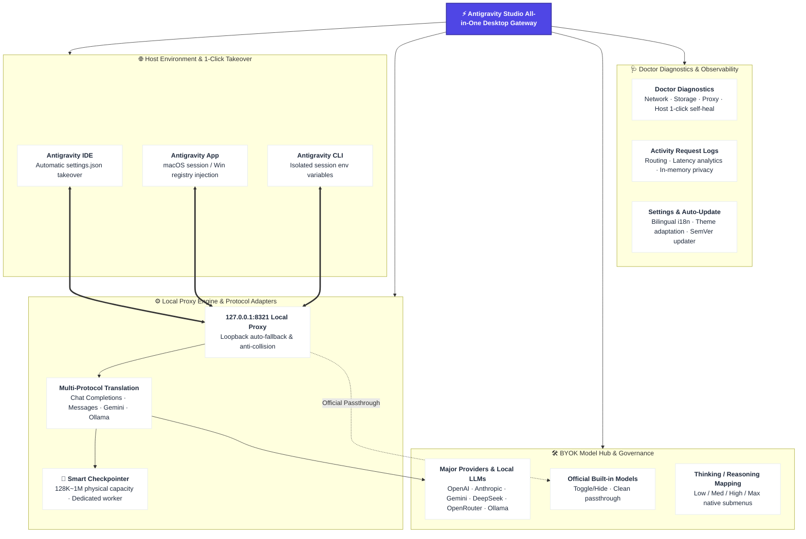

# Antigravity Studio (AGY Studio)

[简体中文](README.md) · English · [Changelog](CHANGELOG.md)

[](LICENSE)
[](#installation)
[](https://kotlinlang.org/)
[](https://www.jetbrains.com/lp/compose-multiplatform/)
[](https://github.com/yuzhiqiang1993/antigravity-studio/releases/latest)

A **flagship desktop hub and productivity studio for the Antigravity AI ecosystem**. Built on the modern **Kotlin + Compose Multiplatform Desktop** architecture, it seamlessly connects **Antigravity IDE**, **Antigravity App**, and **Antigravity CLI** to any third-party AI models through a high-performance local proxy—featuring granular model governance, intelligent context compression, full-stack health diagnostics, and seamless host takeover.

---

### Why Antigravity Studio?

Antigravity natively provides only Google's Gemini models and older Claude models. For developers who love Antigravity's workflow but also subscribe to OpenAI, Claude 3.7 Sonnet, DeepSeek R1, Ollama, or custom API gateways, the lack of native BYOK (Bring Your Own Key) capabilities, tedious multi-account switching, and conservative context compression policies create unnecessary friction.

**Antigravity Studio** was built to eliminate these constraints. Through high-performance local protocol transformation and model routing, you can effortlessly inject your favorite models into Antigravity IDE, App, or CLI while retaining full support for multimodality (Vision), Tool Calling, and granular Thinking / Reasoning effort levels.

---

## ⭐ Recommended Companion: Antigravity IDE Cockpit

If you use Antigravity IDE regularly, we strongly recommend installing the [**Antigravity IDE Cockpit extension**](https://open-vsx.org/extension/yuzhiqiang/antigravity-ide-cockpit) alongside Studio. It is your dedicated multi-account cockpit:

- **Centralized Account Management**: View active accounts, quotas, and Token consumption in one unified sidebar;
- **Smart Hot Switching**: Switch accounts without restarting whenever possible;
- **Quota & Cost Monitoring**: Track real-time AI quota, Token usage trends, and cost estimates;
- **Session & Model Diagnostics**: Detect bad session states and export sanitized reports.

> **💡 Perfect Combo**: **Antigravity Studio** handles model integration and proxying, while **Antigravity IDE Cockpit** manages your accounts, quotas, and sessions. Together, they deliver the ultimate AI coding experience.
> 
> 👉 [Install Cockpit on Open VSX](https://open-vsx.org/extension/yuzhiqiang/antigravity-ide-cockpit) · [Visit Official Website: agycockpit.com](https://agycockpit.com)

---

## 💬 Community

Join our Antigravity community for discussions, updates, and feedback:

- **Telegram Group**: [Join Telegram Group](https://t.me/+IMj6SaNJAAhlNjM1)
- **QQ Group**: `613214996`

---

## 🧭 Feature Overview



### 1. Run Overview

The central dashboard of Antigravity Studio providing comprehensive visibility and control:

- **Proxy Status**: Monitor real-time proxy state, active listening port, and official model synchronization;
- **Readiness Metrics**: Track configured providers, active custom models, and system readiness;
- **Host Detection**: Automatically detects installation and execution states of **Antigravity IDE**, **Antigravity App**, and **Antigravity CLI**;
- **1-Click Takeover & Safe Revert**: Enable proxy takeover for individual hosts with a single click, or safely restore official mode at any time without deleting your saved configurations.

### 2. Provider & Model Management (Model Hub)

- **Rich Provider Presets**: Extensive built-in presets covering major AI providers (OpenAI, Anthropic, Google Gemini, xAI, DeepSeek), popular gateways (OpenRouter, CLIProxyAPI, One API), and local LLMs (Ollama);
- **Dynamic Model Discovery**: Fetch available upstream models with one click and configure which ones to expose to Antigravity;
- **Official Model Governance**: Disable or hide unused built-in models (e.g. Gemini 3.5 Flash) to keep your IDE model selector clean and focused;
- **Multimodal & Capability Configuration**: Granularly configure Image Input (Vision), Tool Calling, and Thinking / Reasoning effort mappings;
- **Connectivity Diagnostics**: Instant latency testing for entire providers, individual models, or official sync endpoints.

#### 2.1 Adding an Upstream Service in 3 Steps
1. **Select Service**: Choose a built-in provider preset or configure a custom endpoint;
2. **Connection Setup**: Enter Base URL and API Key supporting OpenAI, Anthropic, or Gemini protocols;
3. **Select & Custom Models**: Fetch models from upstream, toggle vision, tools, and reasoning levels, then save.

#### 2.2 Model-Level Context Compression (Smart Checkpointer)

Antigravity’s official default compression policy is notably **conservative** (often triggering compression early in a session even when context usage is low). This causes frequent Checkpointer summaries during extended conversations, which adds extra latency, consumes redundant tokens, and risks over-summarizing early code context and chat history.

With Antigravity Studio, you can customize the context compression strategy for each individual official or custom model to reduce compression frequency:

- **Capacity Presets & Fine-tuning**: Choose from presets ranging from **Deep Compression** to **Maximum Fidelity** (e.g., 128K, 200K, 256K, 372K, 1M), or manually set the **Compression Threshold**, **Checkpoint Limit**, and **Reserved Output Tokens** using quick percentages or exact token counts;
- **Compression Worker Model**: Let the compression worker follow the active model or use a fixed, lightweight Gemini Flash model to balance context fidelity, speed, and cost;
- **Default Passthrough**: Select **Official Default** or **Upstream Default** to preserve original limits without injecting custom overrides.

> [!TIP]
> **💡 Context Compression Configuration Tips & Trade-offs:**
> - **⚠️ Setting thresholds too low (Triggers too frequently)**: Triggers compression after just a few conversational turns; each compression incurs an additional LLM call, increasing latency and token usage; historical context is repeatedly summarized, risking the loss of crucial early implementation details.
> - **⚠️ Setting thresholds too high (Too close to model physical limits)**: High risk of exceeding the upstream model's maximum context window and failing with request errors (`Context Window Exceeded` / `400 Bad Request`).
> - **✅ Recommended Practice**: Select a matching preset tier based on your upstream model’s actual maximum context window, leaving a **20% ~ 30% safety buffer** for outputs and tools (e.g., triggering compression around 148K for a 200K-context model).

### 3. Local Proxy & Host Integration

Antigravity Studio uses a high-performance local proxy listening exclusively on the Loopback address (`127.0.0.1`):

- Default port is `8321` (automatically discovers an open port if occupied);
- Native models pass directly to Google Cloud Code; custom models are routed to their respective Provider Adapters;
- Host takeover mechanisms across platforms:

| Platform & Host | Takeover Mechanism | Effect & Reversion |
| :--- | :--- | :--- |
| **macOS / Windows · Antigravity IDE** | Manages `jetski.cloudCodeUrl` in user `settings.json` with reversible ownership tracking | Restarts IDE safely when toggled while running |
| **macOS · Antigravity App** | Manages user-session `CLOUD_CODE_URL` without altering signed application packages | Restarts App safely; auto-restored on Studio launch |
| **Windows · Antigravity App** | Manages user-level `CLOUD_CODE_URL` environment variables and registry | Restarts App safely |
| **macOS · Antigravity CLI** | Manages user-session `CLOUD_CODE_URL` | Takes effect upon reopening terminal window |
| **Windows · Antigravity CLI** | Manages user-level `CLOUD_CODE_URL` environment variable | Takes effect upon reopening terminal window |

### 4. 🩺 Doctor Full-Stack Health Diagnostics

Built-in diagnostics engine providing comprehensive health checks across 6 dimensions:
- **Network & Connectivity**: Tests Google services, GitHub Releases API, and loopback connectivity;
- **Local Storage & Configuration**: Validates `config.json` integrity and read/write permissions;
- **Local Proxy Engine**: Checks port listening status and HTTP/SSE streaming channels;
- **Host Takeover & Paths**: Verifies IDE, App, and CLI installation paths and proxy takeover alignment;
- **Custom Providers**: Validates API keys and upstream responses for all configured providers;
- **1-Click Actionable Fixes**: Pinpoints issues with step-by-step resolution suggestions.

### 5. Activity Logs

- Structured inspectability for forwarded HTTP requests and response metadata;
- Displays timestamp, route category (Official Passthrough / Custom Model), upstream Provider, status code, and latency;
- Real-time refresh, failed request filtering, and one-click in-memory log clearing;
- **Privacy First**: Logs are stored strictly in memory and NEVER record prompt texts, code contents, model responses, headers, or API keys.

### 6. Settings & Auto-Update

- **Localization**: Seamless runtime switching between **English** and **Simplified Chinese**;
- **Themes**: Light, Dark, and System-following appearance modes;
- **Port Management**: Customize local proxy port with quick access to configuration directories;
- **Smart Update Engine**: Built-in semantic versioning (`SemVer`) checks GitHub Releases silently on startup, matching the optimal binary for your OS and CPU architecture (Apple Silicon vs Intel vs Windows);
- **Developer Debug Mode**: Quickly activated via settings or by clicking the version badge in the About section.

---

## ⚙️ How It Works

```text
Antigravity IDE / App / CLI
            │
            │ Select a Model injected by Antigravity Studio
            ▼
   http://127.0.0.1:8321 (Local Loopback Proxy)
            │
            ├─► Official Models ──► Google Cloud Code Native Passthrough
            │
            └─► Custom Models ──► Protocol Transformation (OpenAI / Anthropic / Gemini / Ollama)
                                    │
                                    ▼
                       Upstream Provider / Corporate Gateway / Local LLM
```

---

## 📦 Installation

### 1. Download Prebuilt Binaries (Recommended)

Visit [GitHub Releases](https://github.com/yuzhiqiang1993/antigravity-studio/releases/latest) to download the latest package:

| Operating System & Platform | Recommended Package | Description |
| :--- | :--- | :--- |
| **macOS (Apple Silicon)** | `Antigravity-Studio-1.0.0-macos-arm64.dmg` | Native for M1 / M2 / M3 / M4 Macs |
| **macOS (Intel)** | `Antigravity-Studio-1.0.0-macos-x64.dmg` | Native for Intel x86_64 Macs |
| **Windows (x64)** | `Antigravity-Studio-1.0.0-windows-x64.exe` | For 64-bit Windows 10/11 |

#### First Launch on macOS (Unsigned App Workaround)

If macOS Gatekeeper prevents opening the application:

```bash
sudo xattr -rd com.apple.quarantine "/Applications/Antigravity Studio.app"
```

---

### 2. Build & Run from Source

#### Requirements
- **macOS** (Apple Silicon / Intel) or **Windows 10/11**
- **JDK 17** or **JDK 21** (Temurin or Azul Zulu recommended)

#### Commands
The project includes a comprehensive build automation script [`app_build.sh`](app_build.sh):

```bash
# 1. Run in development mode (Debug)
./app_build.sh run

# 2. Run all unit tests
./app_build.sh test

# 3. Fast build unpackaged independent App bundle
./app_build.sh dist

# 4. Package macOS DMG image
./app_build.sh build --formats dmg

# 5. Full release assembly pipeline (clean + test + package + SHA256 checksums)
./app_build.sh assemble
```

For detailed build configurations and CI/CD matrix details, see [Build & Packaging Guide (app_build.md)](app_build.md).

---

## ❓ Troubleshooting

### Q1: Custom models do not appear in IDE / App after proxy starts?
1. Confirm that at least one model is configured and saved under **Model Hub**;
2. Check **Run Overview** to ensure the local proxy is running;
3. Verify that the host card shows **Taken Over** (Proxy Mode);
4. If the host was already open, wait for safe restart or reopen manually;
5. For CLI hosts, restart the terminal application;
6. Inspect **Activity Logs** to confirm requests are reaching the local proxy.

### Q2: Provider connection test fails?
- Verify Base URL is the root API address (e.g. `https://api.openai.com` for OpenAI protocol without `/v1/chat/completions`);
- Check API key validity and account balance;
- For local services without authentication (e.g. Ollama), API key can be left empty.

### Q3: Does restoring official mode erase my configurations?
- **No**. Reverting only restores host configuration files to official direct connection. Saved providers, models, and settings remain intact.

---

## 🛡️ Unofficial Notice & Disclaimer

- **Unofficial Notice**: Antigravity Studio is an independently developed open-source compatibility tool and is not affiliated with, authorized by, or endorsed by Google or the Antigravity team. This project does not distribute proprietary Antigravity binaries.
- **Disclaimer**: This project is intended solely for personal learning, technical research, and developer productivity. By using this project, you agree to comply with the terms of service and applicable laws of all upstream providers.

---

## 📄 License

This project is licensed under the [MIT License](LICENSE).
