# Antigravity Studio

[简体中文](README.md) · English · [Changelog](CHANGELOG.md)

[](LICENSE)
[](#installation--download)
[](https://kotlinlang.org/)
[](https://www.jetbrains.com/lp/compose-multiplatform/)
[](https://github.com/yuzhiqiang1993/antigravity-studio/releases/latest)

**Antigravity Studio** is a desktop companion designed for the Antigravity ecosystem (IDE editor, standalone App, and CLI).

It allows you to bring your own API keys for third-party LLMs, manage multiple Google accounts and quota balances in one place, adjust long-context compression thresholds, and filter out unused models.

<p align="center">
  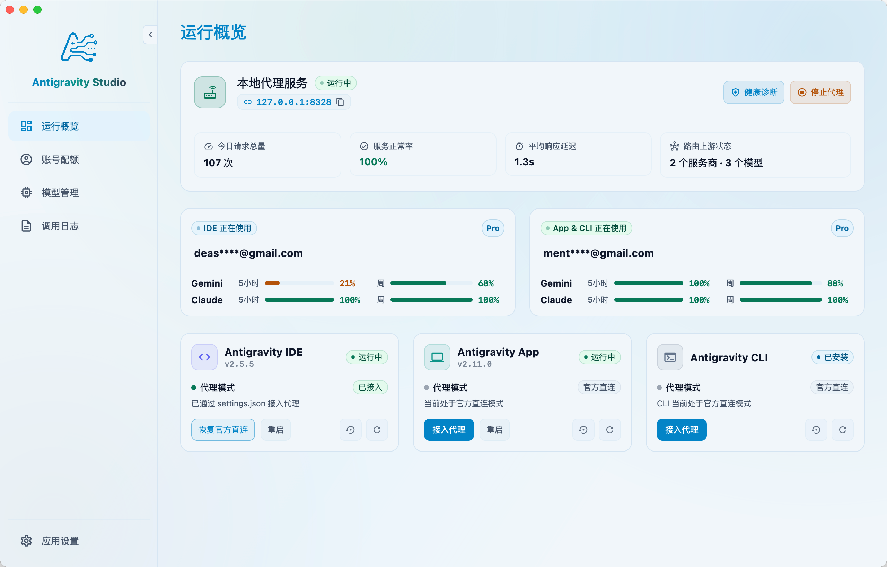
</p>

---

## What Problems Does It Solve?

Common friction points when using Antigravity daily:

1. **Using Third-Party Models**: The built-in model selection is limited. Your own Claude, DeepSeek, GPT, Gemini series, or local Ollama models cannot be directly invoked in Antigravity.
2. **Tedious Multi-Account Switching**: Checking quotas across multiple Google accounts requires constant switching, and changing active accounts requires re-authenticating.
3. **Premature Code Summarization in Long Chats**: The default context compression threshold is relatively low, which can summarize away important code details during extended conversations.
4. **Cluttered Model Dropdown**: Unused official models clutter the dropdown menu, making it harder to pick your preferred model.

---

## Features

### 1. Bring Your Own Key (BYOK) for Any Model
- **Mainstream Providers & Custom Endpoints**: Built-in support for OpenAI, Anthropic, Gemini, DeepSeek, xAI, local Ollama, and OpenAI-compatible API gateways.
- **One-Click Fetch & Inject**: Enter your API key to fetch available models and seamlessly add them to Antigravity's model dropdown.
- **Full Feature Support**: Retains multimodal image inputs, code tool calling (Tools), and Thinking reasoning levels.
- **Direct & Private**: Requests travel directly from your local machine to your provider without third-party intermediate servers.

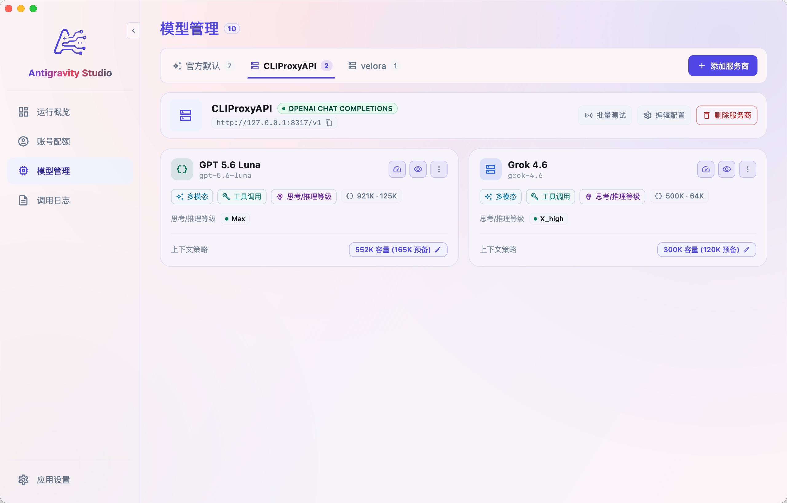
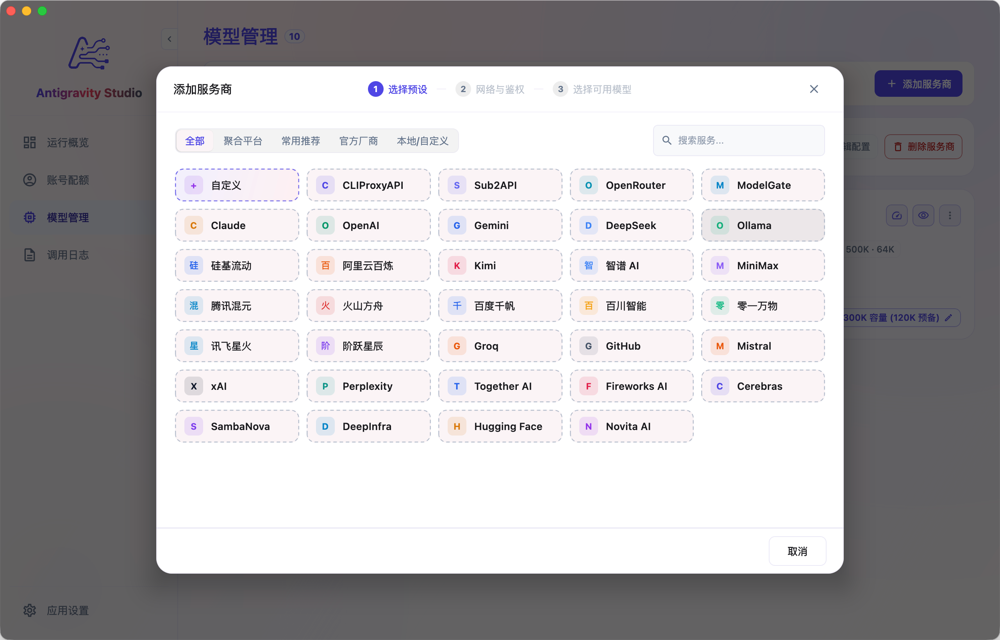
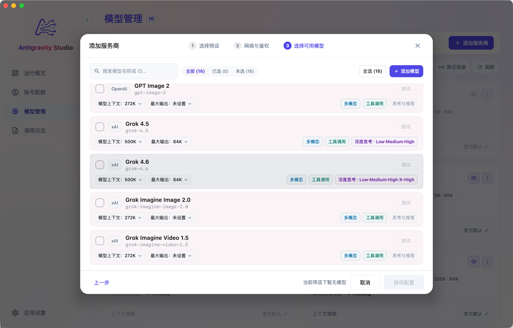

### 2. Multi-Account Quota Monitoring & Fast Switching
- **Centralized Account Management**: Add Google accounts via one-click browser login or by pasting Refresh Tokens.
- **Live Quota Tracking**: View 5-hour and weekly quota balances and reset countdowns for Gemini & Claude across all accounts.
- **Instant Account Switching**: Switch active accounts for IDE, App, or CLI with a single click without logging in again.

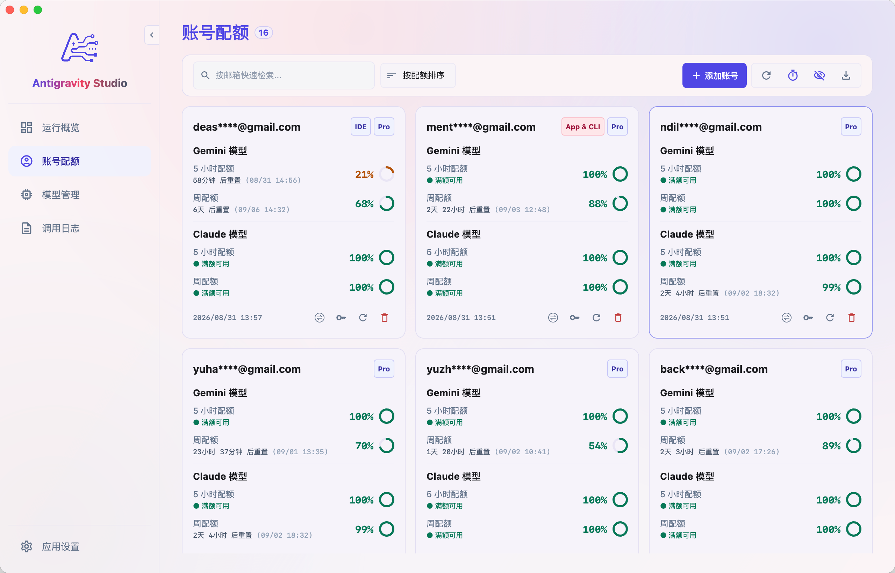
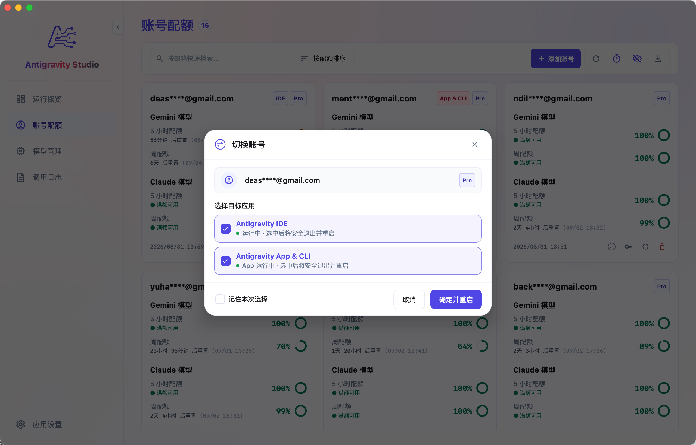

### 3. One-Click Proxy Integration & Direct Revert
- **Host Status Detection**: Automatically detects running instances of Antigravity IDE, App, and CLI.
- **Safe & Reversible**: Click "Connect Proxy" to integrate, and click "Restore Direct Connection" to revert at any time without modifying any official binaries.

### 4. Hide Unused Models & Custom Context Compression
- **Streamlined Model List**: Hide unused official models so the IDE dropdown stays clean and relevant.
- **Higher Compression Thresholds**: Choose from presets like 128K, 200K, 256K, 372K, or 1M to delay summarization and preserve code details in long chats.

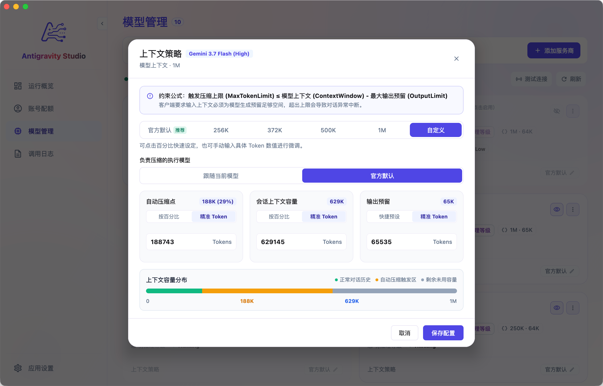

### 5. Health Check & Diagnostics (Doctor)
- Diagnose connectivity, local proxy port binding, config file integrity, and provider health with one click, with built-in guided auto-fixes.

### 6. Token Usage Statistics & Trends
- **Multi-Dimensional Analytics**: Track total tokens, input/output usage, Prompt cache hit rate, and estimated savings across flexible timeframes (Today, 1 Day, 7 Days, 14 Days, 30 Days, or Custom Date Range).
- **Daily Consumption Trends**: Inspect daily token consumption curves over time.
- **Top Models Ranking**: Monitor request counts and token share across models to keep track of usage costs.

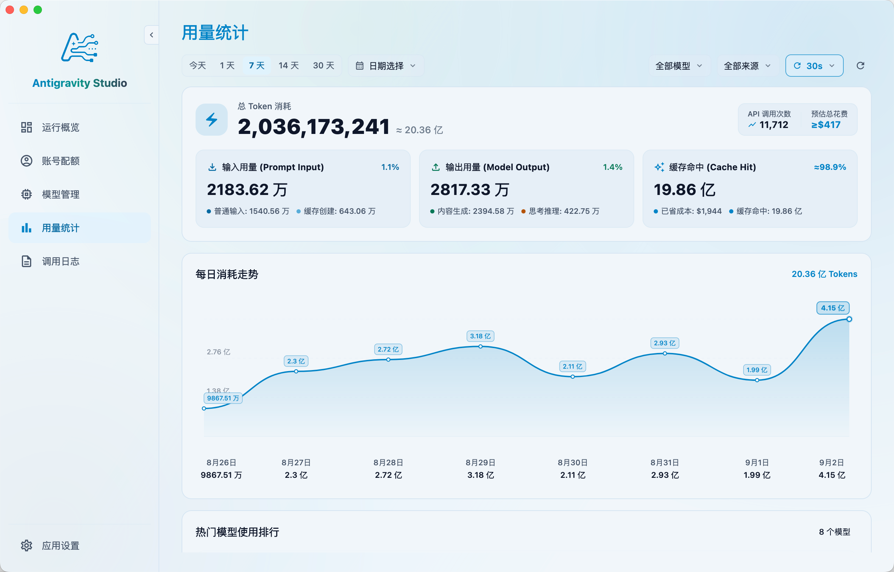

### 7. Activity Logs & Latency Analytics
- **Request Inspection**: Inspect local request paths, model names, latency, upstream status codes, and throughput (TPS).
- **Latency & Speed Analysis**: Aggregate TTFT (Time to First Token), generation speed, and total session duration across models.
- **Local Privacy**: Logs exist strictly in local memory and clear upon exit. No code, prompts, responses, or API keys are recorded.

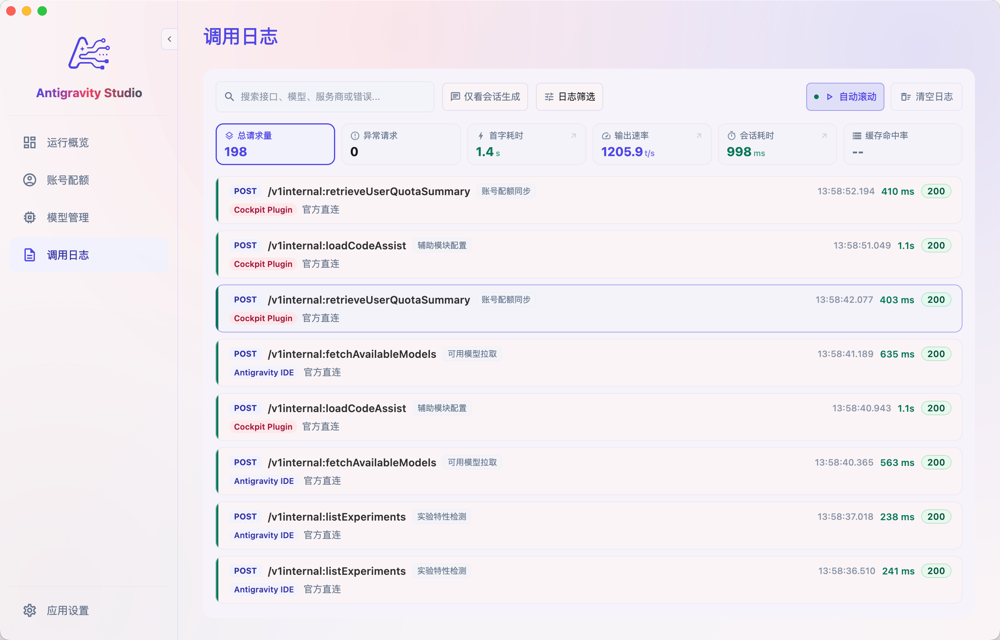
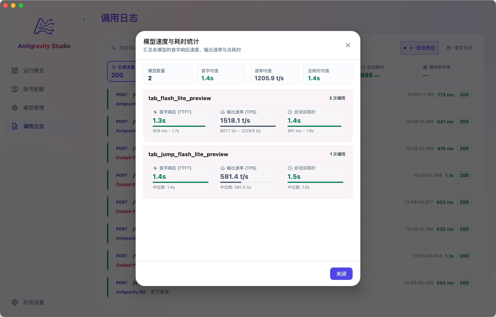

### 8. Appearance & General Preferences
- **Appearance**: Light and dark themes with multiple Material 3 color schemes.
- **General Settings**: Multi-language support (English / Simplified Chinese), default switch target app, and update checks.

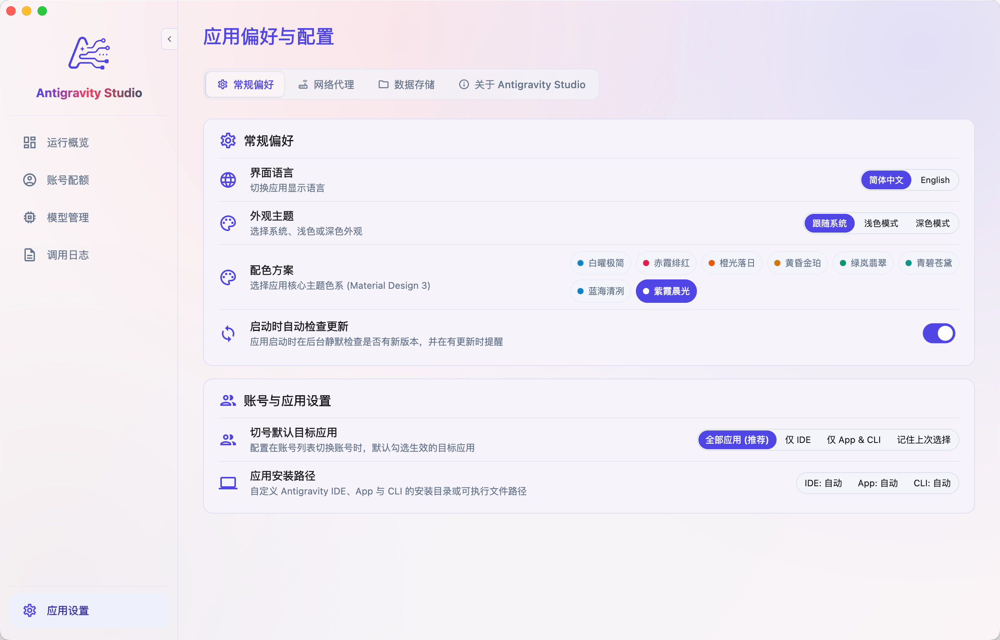
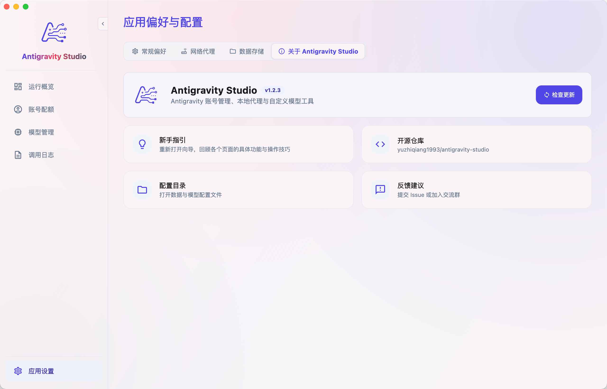

---

## How It Works

```text
Antigravity IDE / App / CLI
            │
            ▼ (Requests sent to local proxy)
   http://127.0.0.1:8321
            │
            ├─► Official Models ──► Direct pass-through to Google servers
            │
            └─► Custom Models ──► Protocol translation directly to provider
                                  │
                                  ▼
                         OpenAI / Claude / DeepSeek / Ollama etc.
```

---

## Desktop App & IDE Extension Pairing

| Product | Focus & Primary Use Case |
| :--- | :--- |
| **Antigravity Studio (Desktop)** | **Third-party Model Integration & Host Proxy Management**<br>Best for bringing your own API keys for custom models (cloud/local), adjusting context compression thresholds, filtering official models, and managing IDE / App / CLI integration. |
| **[Antigravity IDE Cockpit (Extension)](https://open-vsx.org/extension/yuzhiqiang/antigravity-ide-cockpit)** | **In-IDE Account Switching & Session Context Insights**<br>Runs directly inside Antigravity IDE for smooth in-editor account switching, real-time token tracking, and session diagnostics. |

> 💡 **Recommendation**: Use **Studio Desktop** for custom model routing and host proxy management, and use **Cockpit Extension** inside the IDE for account switching and context tracking.

👉 [Install Cockpit on Open VSX](https://open-vsx.org/extension/yuzhiqiang/antigravity-ide-cockpit) · [Visit Website agycockpit.com](https://agycockpit.com)

---

## Installation & Download

### 1. Download Prebuilt Binaries (Recommended)

Download the installer for your operating system from [GitHub Releases](https://github.com/yuzhiqiang1993/antigravity-studio/releases/latest):

| Operating System & Platform | Recommended Package | Description |
| :--- | :--- | :--- |
| **macOS (Apple Silicon)** | `Antigravity-Studio-x.x.x-macos-arm64.dmg` | For Apple Silicon (M1 / M2 / M3 / M4) Macs |
| **macOS (Intel)** | `Antigravity-Studio-x.x.x-macos-x64.dmg` | For Intel-based Macs |
| **Windows (x64)** | `Antigravity-Studio-x.x.x-windows-x64.exe` | For 64-bit Windows 10 / 11 |

> 💡 **macOS First Launch Note (Unsigned App Workaround)**
> If macOS Gatekeeper blocks opening the app, run the following command in Terminal:
> ```bash
> sudo xattr -rd com.apple.quarantine "/Applications/Antigravity Studio.app"
> ```

---

### 2. Quick Start in 3 Steps

1. **Add Provider & Models**: Open Studio, go to **Model Management**, select your provider (e.g. DeepSeek, OpenAI, or Claude), enter your API Key, and select the models you want to use.
2. **Connect Proxy**: Go to **Overview**, and click **Connect Proxy** on the target host card (e.g. Antigravity IDE).
3. **Start Coding**: Reopen Antigravity IDE and pick your newly added model from the model dropdown.

---

### 3. Build from Source

Requirements: JDK 17 or JDK 21 (Temurin or Azul Zulu recommended).

```bash
# Run locally
./app_build.sh run

# Run tests
./app_build.sh test

# Package macOS DMG
./app_build.sh build --formats dmg
```

---

## FAQ

**Q: Custom models do not show up in the IDE after connecting the proxy?**
- Verify that models have been added and enabled in "Model Management".
- Ensure the proxy is running and the IDE card shows "Proxy Mode" in "Overview".
- Restart Antigravity IDE to reload settings.

**Q: Does reverting to official direct connection delete my configurations?**
- No. Reverting only resets the host network target. All added providers, keys, models, and settings remain saved locally.

**Q: Are my API keys and code safe?**
- Yes. Antigravity Studio is 100% locally executed open-source software with no external cloud servers. All configurations stay on your machine, and requests are sent directly to your chosen providers.

---

## Community & Feedback

- **QQ Group**: `613214996`
- **Telegram Group**: [Join Telegram Group](https://t.me/+IMj6SaNJAAhlNjM1)
- **Issues & Feedback**: Welcome to submit issues or feature requests on [GitHub Issues](https://github.com/yuzhiqiang1993/antigravity-studio/issues)

---

## License & Disclaimer

- **License**: Released under the [MIT License](LICENSE).
- **Disclaimer**: Antigravity Studio is an independent open-source tool and is not affiliated with Google or the official Antigravity team. Please comply with the terms of service of your respective LLM providers.
