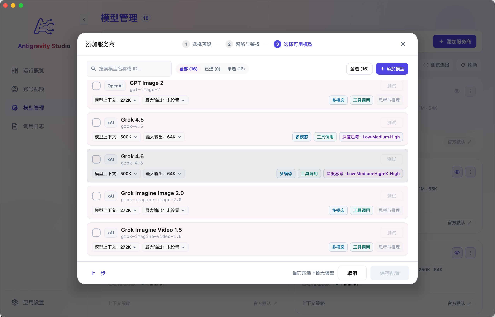
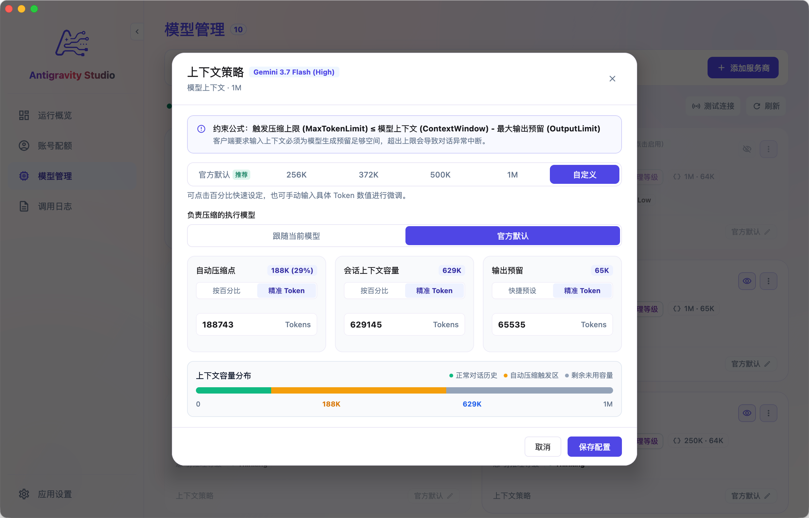
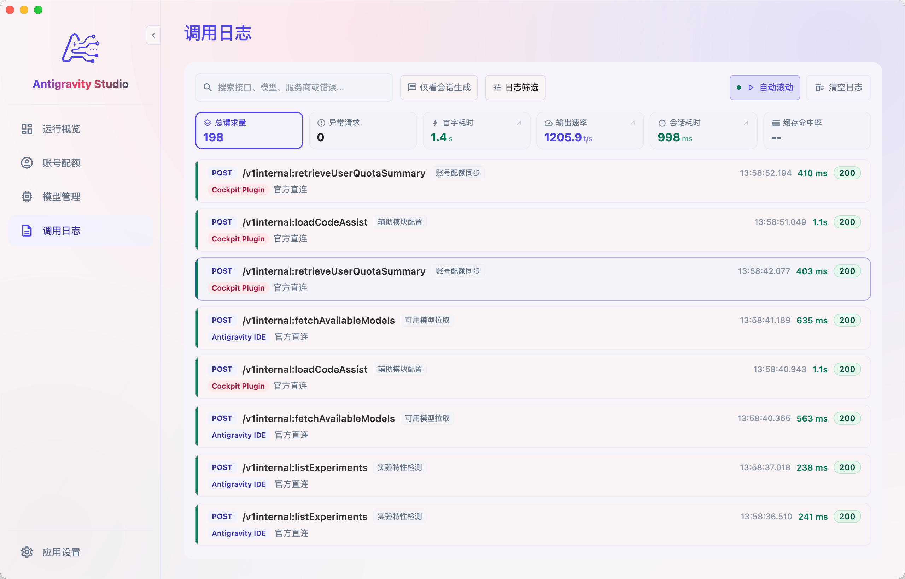
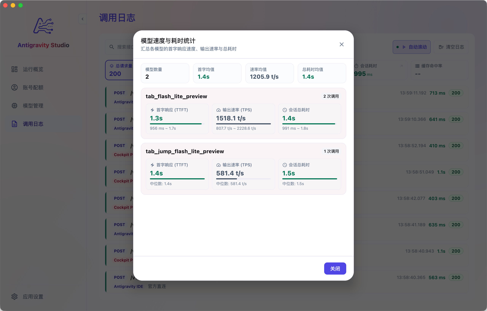
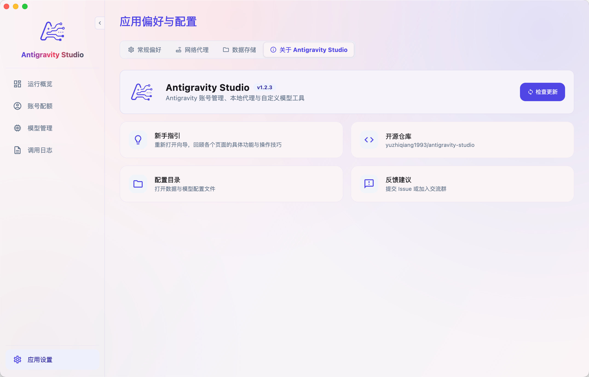

# Antigravity Studio

[简体中文](README.md) · English · [Changelog](CHANGELOG.md)

[](LICENSE)
[](#installation--download)
[](https://kotlinlang.org/)
[](https://www.jetbrains.com/lp/compose-multiplatform/)
[](https://github.com/yuzhiqiang1993/antigravity-studio/releases/latest)
[](#community--feedback)

**Antigravity Studio** is a desktop companion and local proxy tool built for the Antigravity ecosystem (IDE editor, standalone App, terminal CLI, and VS Code extensions).

It features a smart account pool and multi-strategy dispatch engine that prioritizes expiring quotas to prevent waste while seamlessly recovering from rate limits. It also lets you bring your own API keys (BYOK) for third-party LLMs, customize long-context compression thresholds, hide unused models, and monitor real request latencies and token usage locally.

> 💬 **Community & Discussion**: Join our QQ group **`613214996`** for release updates, configuration tips, and troubleshooting.

<p align="center">
  
</p>

---

## What Problems Does It Solve?

Common friction points when using Antigravity daily:

1. **Quota Waste & Frequent Rate Limits**: Official Google quotas roll on a 5-hour cycle and reset weekly; unused quotas expire without carrying over (Use-it-or-lose-it). Single accounts often hit 429 rate limits during intensive coding sessions while backup accounts sit idle. Switching accounts requires re-authenticating across tools and breaks focus.
2. **Multi-Session Collisions & Cache Invalidation**: Running multiple windows or concurrent projects on a single account frequently triggers concurrency throttles. Inconsistent switching also destroys the provider's server-side Prompt Cache, forcing full context recomputations and spiking latency.
3. **Missing Third-Party & Reasoning Models**: The built-in model lineup is limited. You cannot directly invoke Claude, DeepSeek (with full Thinking reasoning streams), GPT, or local Ollama models in Antigravity.
4. **Premature Code Summarization in Long Chats**: The default context compression threshold is relatively low, often summarizing away important code details during deep multi-turn sessions.
5. **Cluttered Model Dropdowns**: Too many unused official models crowd the dropdown, making it cumbersome to find your go-to models.

---

## Features

### 1. Smart Account Pool & Multi-Strategy Dispatch
Manage multiple Google accounts with automatic local proxy interception and strategy routing:

- **Three Dispatch Strategies**:
  - **Failover Relay**: Primary account priority. Directly uses the active host account under normal conditions. When quota drops below the candidate threshold (default 5%) or encounters a 429/403 error, the proxy silently routes requests to the optimal standby account. Once the host account recovers and the cooldown expires, traffic automatically reverts. For Claude calls, requests automatically route to Claude-supported accounts if the primary is restricted.
  - **Sticky Session**: Binds each conversation session to a dedicated account throughout its lifecycle. Subsequent requests always target the same account to maximize server-side Prompt Cache hits and cut latency. Uses exclusive bindings when capacity allows and balances across least-loaded accounts otherwise. Subagents transparently inherit parent session accounts without consuming extra slots.
  - **Round Robin**: Smoothly rotates requests across healthy accounts to evenly distribute concurrent loads and mitigate rate limits. Quickly fails over to the next candidate on 429 errors.
- **Sprint Priority & Quota Maximization (Use-it-or-lose-it)**:
  - **Dynamic Urgency Scoring**: Quotas expire when reset timers lapse. The engine scores candidates by `Urgency = Remaining Quota ÷ Time Until Reset`, routing traffic to accounts closest to reset with sufficient balance to fully exhaust expiring quotas. Weekly resets carry the highest priority.
  - **Model Family Partitioning**: Gemini and Claude quotas are tracked and pooled separately to prevent cross-model quota starvation.
  - **Adaptive Threshold Degradation**: Automatically ignores candidate minimum thresholds when the entire pool is depleted, squeezing remaining non-zero balances to keep services running until quotas refresh.
- **Per-Account Outbound Proxy**: Configure dedicated HTTP / SOCKS5 proxies per account with isolated connection pools across token refreshes, quota polling, and request dispatching, keeping network egress and IPs segregated.
- **Pool Quota Dashboard & Health Monitoring**:
  - Aggregates available balance, total points, and healthy accounts per model family.
  - Live Claude availability indicators (Available, Untested, Rate Limited, Restricted).
  - Restricted account cards highlighted with red borders, raw error inspect tooltips, and action guidance.
  - Active accounts pinned with neon borders; standby candidates clearly tagged with priority ranks.
  - System tray icon with live hover tooltips displaying relay status and active proxy accounts.
- **One-Click Account Switching**: Add Google accounts via one-click browser login or by pasting Refresh Tokens. Switch active accounts for IDE, App, CLI, or VS Code with one click and coordinated restarts.


### 2. Bring Your Own Key (BYOK) for Any Model
- **Mainstream Providers & Custom Endpoints**: Built-in presets for OpenAI, Anthropic, Gemini, DeepSeek, xAI, local Ollama, and OpenAI-compatible gateways.
- **Reasoning Chains & Tool Calling Compatibility**: Full parsing for DeepSeek `reasoning_text` streaming and non-streaming thought deltas. Supports multimodal image inputs, code tool calling (Tools), and cross-protocol Tool Call ID pairing with fallback text demotion for orphaned outputs.
- **One-Click Fetch & Inject**: Enter your API key to fetch available models and seamlessly inject them into Antigravity's model selector.
- **Direct & Private**: Requests travel directly from your machine to your configured provider without intermediate third-party servers.




### 3. One-Click Proxy Integration & Safe Revert
- **Multi-Host Detection**: Automatically identifies running instances and versions of Antigravity IDE, App, CLI, and VS Code extensions.
- **Process Management**: Kill running host processes and full subprocess trees with one click.
- **Safe & Reversible**: Click "Connect Proxy" to integrate, and "Restore Direct Connection" to revert at any time without modifying any official binaries.

### 4. Hide Unused Models & Custom Context Compression
- **Streamlined Model List**: Hide unused official models so the IDE dropdown stays focused on relevant options.
- **Context Capacity & Compression Policies**: Supports native official compression policies (`CASCADE_USE_EXPERIMENT_CHECKPOINTER`) and auto-derives policies for custom models. Choose presets from 128K to 1M to delay summarization and preserve code details in long chats.



### 5. Activity Logs & End-to-End Performance Metrics
- **Monotonic E2E Metrics**: Measures true end-to-end throughput (E2E TPS), Time to First Token (TTFT), queue duration, and generation speed (TPOT) via monotonic clocks.
- **Dual-Pane Persistent Details & cURL Export**: Inspect payloads and metrics side-by-side on widescreen displays without dialogs, with one-click export of escaped terminal cURL commands.
- **Agent Task Awareness**: Automatically tags context compression, terminal checks, title generation, and tool invocations, backfilling reasoning token counters.
- **Local SQLite Persistence**: Built on AndroidX Room KMP and bundled SQLite with tiered hot/cold pagination. Data stays strictly local with configurable 1–30 day retention or one-click cleanup.




### 6. Token Usage Analytics
- **Multi-Dimensional Analytics**: Track total tokens, input/output usage, Prompt cache hit rate, and estimated savings across flexible timeframes (Today, 1 Day, 7 Days, 14 Days, 30 Days, or Custom Date Range).
- **Daily Trends & Top Models**: Inspect daily token consumption curves and analyze request counts and token share across models.


### 7. Health Check & Diagnostics (Doctor)
- Diagnose network connectivity, local proxy port binding, config file integrity, and host integration status with one click, complete with automated fixes.

### 8. Appearance & General Preferences
- **Appearance**: Light and dark themes with multiple Material 3 color schemes.
- **General Settings**: English / Simplified Chinese UI toggle, default switch target app, and version update checks.




---

## How It Works

```text
Antigravity IDE / App / CLI / VS Code
            │
            ▼ (Requests sent to local proxy)
    http://127.0.0.1:8321
            │
            ├─► Official Models (Gemini / Claude)
            │         │
            │         ▼
            │    ┌───────────────────────────────────────────────┐
            │    │         Smart Account Pool Engine             │
            │    │ ┌───────────────────────────────────────────┐ │
            │    │ │ Selectors: Failover / Sticky / Round Robin│ │
            │    │ ├───────────────────────────────────────────┤ │
            │    │ │ Urgency Score: Remaining ÷ Time to Reset  │ │
            │    │ ├───────────────────────────────────────────┤ │
            │    │ │ Failover: 429 Cooldown / Claude Probing   │ │
            │    │ └───────────────────────────────────────────┘ │
            │    └───────────────────────┬───────────────────────┘
            │                            │
            │                            ▼ (Routed via per-account egress proxies)
            │                     Google Official Servers
            │
            └─► Custom Models (BYOK)
                      │
                      ▼ (Local protocol conversion, reasoning & tool adapters)
            OpenAI / Anthropic / DeepSeek / Ollama etc.
```

---

## Desktop App & IDE Extension Recommendation

| Product | Role & Core Scenario |
| :--- | :--- |
| **Antigravity Studio (Desktop)** | **Account Pool Dispatch, BYOK Integration & Local Proxy**<br>Manages multi-account quota pools, dispatch strategies, per-account egress proxies, BYOK model injections, long-context compression policies, and multi-host takeovers (IDE / App / CLI / VS Code). |
| **[Antigravity IDE Cockpit (Extension)](https://open-vsx.org/extension/yuzhiqiang/antigravity-ide-cockpit)** | **In-IDE Account Switching & Context Insights**<br>Runs inside Antigravity IDE for smooth in-editor account switching, real-time session token analytics, and sanitized diagnostics. |

> 💡 **Recommendation**: Let **Studio Desktop** handle account pooling and model proxying, while using **Cockpit Extension** inside the IDE for in-editor switching and session analytics.

👉 [Install Cockpit on Open VSX](https://open-vsx.org/extension/yuzhiqiang/antigravity-ide-cockpit) · [Official Website agycockpit.com](https://agycockpit.com)

---

## Installation & Download

### 1. Pre-built Binaries (Recommended)

Download the installer for your platform from [GitHub Releases](https://github.com/yuzhiqiang1993/antigravity-studio/releases/latest):

| OS & Platform | Package | Notes |
| :--- | :--- | :--- |
| **macOS (Apple Silicon)** | `Antigravity-Studio-x.x.x-macos-arm64.dmg` | For M1 / M2 / M3 / M4 Apple Silicon Macs |
| **Windows (x64)** | `Antigravity-Studio-x.x.x-windows-x64.exe` | For 64-bit Windows 10 / 11 |

> 💡 **macOS "App is damaged" or "Cannot be opened"?**
> This is caused by macOS Gatekeeper blocking unsigned binaries. Open Terminal and run:
> ```bash
> sudo xattr -rd com.apple.quarantine "/Applications/Antigravity Studio.app"
> ```

---

### 2. Quick Start in 3 Steps

1. **Configure Accounts or Third-Party Models**:
   - **For Official Models**: Log in or import Google accounts in **Account Quotas**, then open **Dispatch Settings** to pick a strategy (e.g. "Failover Relay" or "Sticky Session").
   - **For Third-Party Models**: Add a provider (e.g. DeepSeek, OpenAI, Claude) in **Model Management**, input your API key, and select the models you want.
2. **Connect Proxy**: In **Overview**, click **Connect Proxy** on the target host card (e.g. Antigravity IDE).
3. **Start Coding**: Reopen Antigravity IDE and choose your newly added model from the dropdown. When invoking official models, the proxy dispatches traffic across your account pool automatically.

---

## FAQ

**Q: Will automatic relay interrupt ongoing coding sessions?**
- No. With Sticky Session, existing conversations remain pinned to their original account to preserve the Prompt Cache. With Failover Relay, standby accounts step in transparently in the background only when the primary hits a 429 or exhausts its quota, without disrupting editor workflows.

**Q: Why use "Sprint Priority"? Won't it deplete certain accounts too quickly?**
- Official Google quotas refresh on rolling schedules and reset automatically; unused quotas do not roll over. Sprint Priority targets accounts closest to resetting to extract maximum value from quotas that would otherwise be discarded, increasing overall usable token capacity.

**Q: Can each account use a different proxy node?**
- Yes. You can configure individual HTTP or SOCKS5 proxies on each account card, isolating exit IP addresses to avoid collateral risk across accounts.

**Q: Added models don't appear in the IDE dropdown after connecting?**
- Verify that models are enabled in **Model Management**;
- Check that the local proxy is running and the IDE card displays "Connected";
- Restart Antigravity IDE to reload the configuration.

**Q: Does restoring direct connection erase my settings?**
- No. Restoring direct connection only resets host network routing back to official endpoints. All accounts, keys, models, and settings remain safely stored locally.

**Q: Are my API keys, credentials, and code secure?**
- Yes. Antigravity Studio is 100% open-source and operates strictly locally. There are no remote backend servers. All credentials stay on your machine, and requests are sent directly to official endpoints or your configured providers.

---

## Community & Feedback

Welcome to join our community for configuration tips, updates, and discussion:

- **QQ Group**: `613214996` (Primary community for discussion and quick Q&A)
- **Issue Tracker**: Submit bug reports and feature requests on [GitHub Issues](https://github.com/yuzhiqiang1993/antigravity-studio/issues)

---

## License & Disclaimer

- **License**: Released under the [MIT License](LICENSE). Source code and build instructions are available at [antigravity-studio-core](https://github.com/yuzhiqiang1993/antigravity-studio-core).
- **Disclaimer & Risk Notice**:
  - Antigravity Studio is an independent open-source project and is not affiliated with Google or the official Antigravity team. Please follow the respective service terms of each model provider.
  - Google's risk control and quota enforcement policies are constantly evolving and subject to unpredictable changes. Any consequences arising from the use of this tool (including, but not limited to, rate limits, abnormal account flags, suspensions, or quota deductions) are entirely your own responsibility, and the project and its developers assume no liability.
  - **If you have any concerns regarding potential impacts on your personal or work accounts, please do not use this tool.**
