# Antigravity Studio

简体中文 · [English](README.en.md) · [更新日志](CHANGELOG.md)

[](LICENSE)
[](#安装与下载)
[](https://kotlinlang.org/)
[](https://www.jetbrains.com/lp/compose-multiplatform/)
[](https://github.com/yuzhiqiang1993/antigravity-studio/releases/latest)
[](#交流与反馈)

**Antigravity Studio** 是为 Antigravity 生态（IDE 编辑器、独立 App、终端 CLI 以及 VS Code 插件）设计的桌面辅助与代理工具。

它内置智能账号池与多策略调度引擎，按重置倒计时优先消耗临期配额，遇到限流平滑接棒；同时支持自带 Key (BYOK) 接入第三方大模型、调整长对话上下文压缩阈值、隐藏不常用模型，并在本地记录真实的请求耗时与 Token 消耗。

> 💬 **用户交流大本营**：欢迎加入 QQ 交流群 **`613214996`**，交流配置心得、反馈问题与获取新版本动态。

<p align="center">
  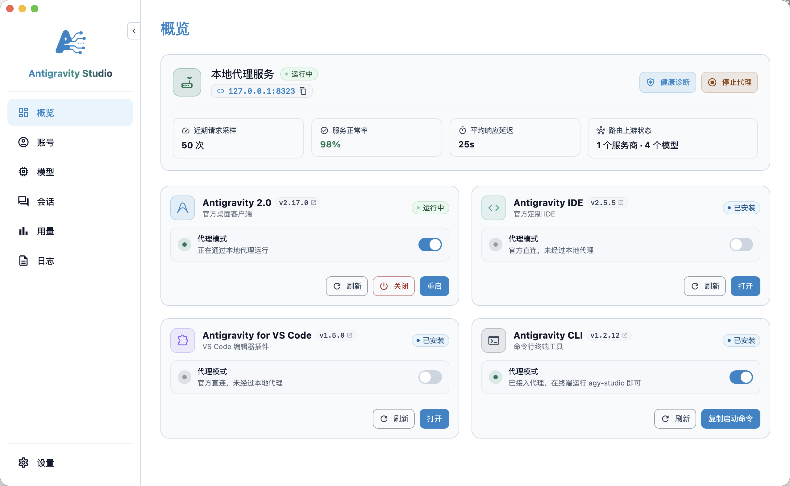
</p>

---

## 它能解决什么问题？

日常用 Antigravity 写代码，常见这几个痛点：

1. **多账号配额浪费与高频限流**：Google 官方配额按 5 小时滚动和每周重置，到期未用完直接清零作废。单个账号高频调用容易遇到 429 限流报错，手头闲置的其他账号又用不上；换号不仅要在各端反复重登，还容易打断编码思路。
2. **多会话并发相互干扰与缓存失效**：开多个项目或多窗口并行写代码时，所有请求挤在同一个账号上，容易触发并发限流；如果频繁乱序切号，还会破坏服务端的 Prompt Cache（上下文缓存），导致每次都要重新计算完整上下文，拖慢首字响应。
3. **想用第三方模型与思考模型**：官方自带模型种类有限，手头的 Claude、DeepSeek（含完整 Thinking 思维链）、GPT 或本地 Ollama 无法直接在 Antigravity 中调用。
4. **长对话关键代码被过早总结**：官方默认的上下文压缩阈值偏低，多轮对话后容易丢失关键实现细节与上下文信息。
5. **模型下拉列表冗长**：列表里堆满大量不常用的官方模型，找想用的模型费时费力。
6. **多端会话轨迹离散，历史回溯困难**：在 IDE、桌面独立 App 与终端 CLI 之间穿插工作，对话记录分散在各端；默认标题千篇一律，无法一眼辨识任务内容，难以检索与归档。

---

## 功能特性

### 1. 智能账号池与多策略调度
统一管理多个 Google 账号，由本地代理层自动接管流量并按策略调度：

- **三大调度策略**：
  - **智能接力 (Failover Relay) ★**：单号优先。平时优先使用当前主账号；当主号剩余配额低于换号阈值（默认 20%）或者遭遇 429 限流、403 异常时，代理在后台自动挑选最优备用号接棒，避免请求中断。主账号配额恢复且冷却期满后，自动切回主号服务。调用 Claude 时若主号受限，会自动挑选支持 Claude 的备用号接力。
  - **会话隔离 (Sticky Session)**：为每个会话分配专属账号并长效绑定，同会话所有后续请求固定走同一账号，最大化利用官方服务端的 Prompt Cache 降低延迟；账号充足时优先独占绑定，账号紧张时在占用最少的账号间平摊；子任务与子代理（Subagent）自动继承父会话账号，不重复占坑；后台辅助任务（如标题提炼）不占用独立绑定。
  - **负载均衡 (Round Robin)**：请求在健康账号之间平滑轮询分发，均匀分担并发流量，避免单号过早限流；遇到限流快速向后漂移转移；子代理同样跟随父会话分配的账号。
- **临期冲刺与配额最大化利用 (Use-it-or-lose-it)**：
  - **动态紧迫度评分**：官方配额到期会自动刷新，未用完的额度直接作废。系统按 `紧迫度 = 剩余配额 ÷ 距离重置时间` 动态打分（界面直观呈现分值），优先调度距离重置最近、剩余额度充裕的账号，抢在刷新前把临期配额消耗殆尽；周配额临期时享有最高优先级。
  - **模型族配额严格隔离**：Gemini 与 Claude 模型族独立分池与核算，双窗口独立环形进度（5小时滚动配额 + 周配额）及重置倒计时直观可视，杜绝跨模型族配额挤占。
  - **自适应退守保底**：支持自定义换号阈值（默认 20%，支持灵活调整），低于门槛的账号自动避让；当全池所有账号均低于门槛时，门槛自适应失效，自动调用全池剩余微量额度保底服务，直到有账号刷新回血。
- **单账号独立出网代理**：支持为每个账号独立配置 HTTP / SOCKS5 代理节点，在 Token 刷新、配额轮询与请求转发中按账号派发独立连接池，实现不同账号在网络环境与 IP 维度的物理隔离。
- **账号池总配额大盘与状态感知**：
  - 汇总各模型族可用余量、总点数与健康账号数；
  - 实时检测并展示各账号 Claude 模型支持状态（稳定可用、未测试、已限流、受限）；
  - 正在服务的账号卡片高亮标注（如“接力中”、“App & CLI”），清晰展示接力与待命状态；
  - 系统托盘（macOS/Windows）悬浮实时显示当前接力状态、出口账号与主号映射关系。
- **一键切换主号**：支持浏览器一键登录或粘贴 Refresh Token 录入多个 Google 账号；点击即可勾选切换 Antigravity IDE、独立 App、CLI 与 VS Code 扩展的生效账号，并联动安全重启生效。

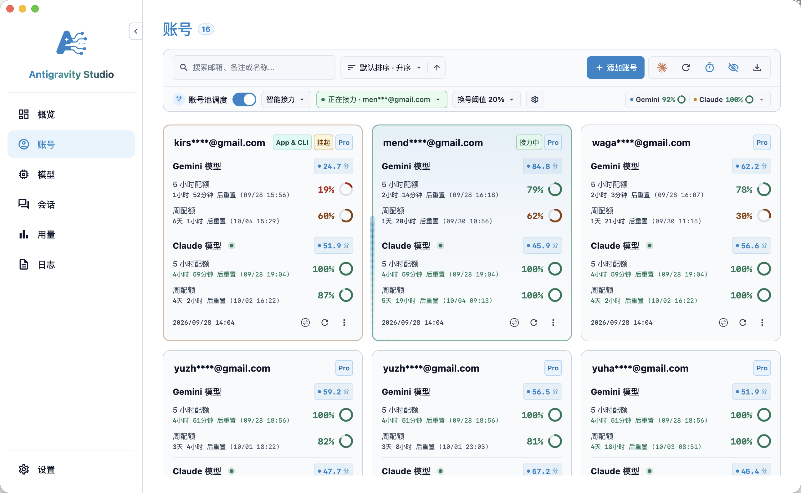
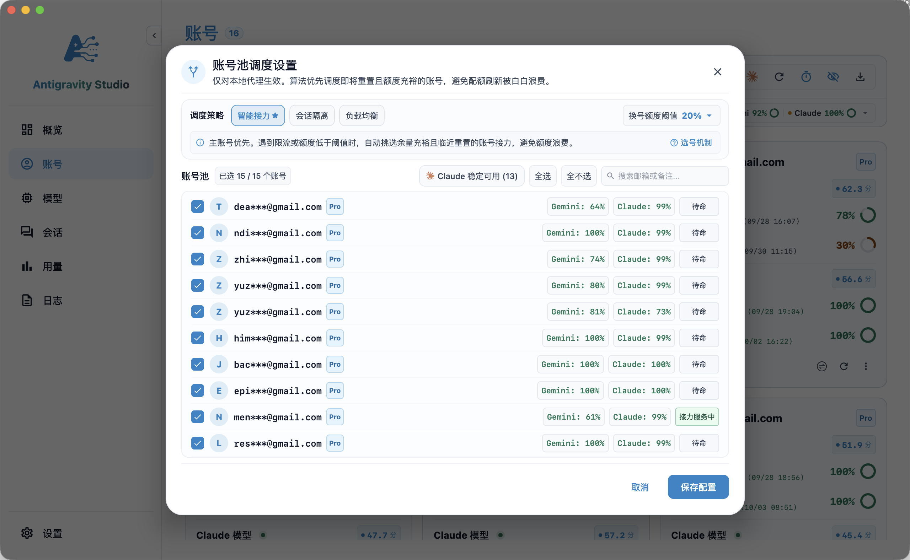
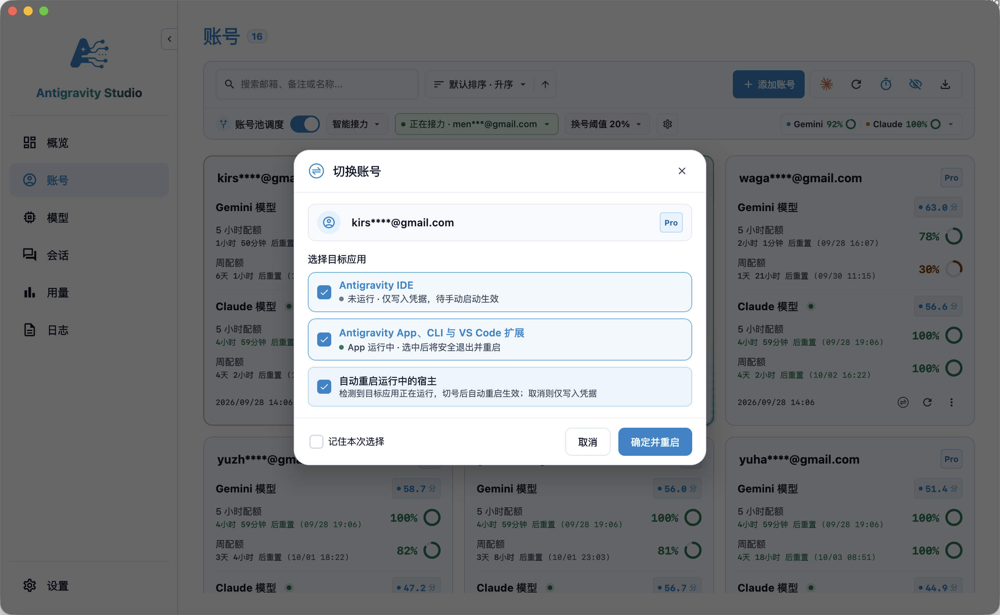

### 2. 自带 Key 接入任意模型 (BYOK) 与能力调优
- **丰富的服务商预设**：内置 34+ 主流平台与聚合中转预设（OpenAI、Anthropic、Gemini、DeepSeek、Ollama、OpenRouter、Sub2API、CLIProxyAPI、硅基流动、阿里云百炼、Kimi、智谱 AI 等），支持 3 步向导极速接入。
- **思维链与复杂工具兼容**：无损解析 DeepSeek 等模型的 `reasoning_text` 流式增量与非流式思考链；支持多模态图片输入与代码工具调用 (Tools)；针对跨协议 Tool Call ID 自动配对，未匹配项自动降级转文本，防止上游 400 校验报错。
- **模型特性与上下文窗口灵活定制**：直接在卡片上查看多模态、工具调用、思考/推理等级（High / Medium / Low / Thinking）标签；支持为模型单独定制上下文窗口配置（如 512K、1M 或官方默认），推迟总结触发时机，避免长对话丢失代码细节。
- **纯本地直连与调试**：填入 Key 后支持一键测试连接并拉取模型列表；支持查看原始 JSON 与修改后 JSON；请求直接从本机发送至你配置的服务商端点，不经过任何第三方中间服务器。

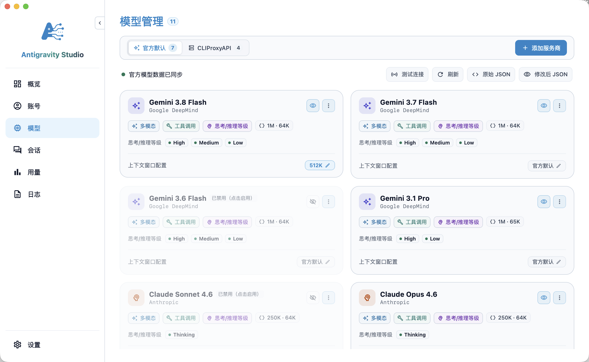
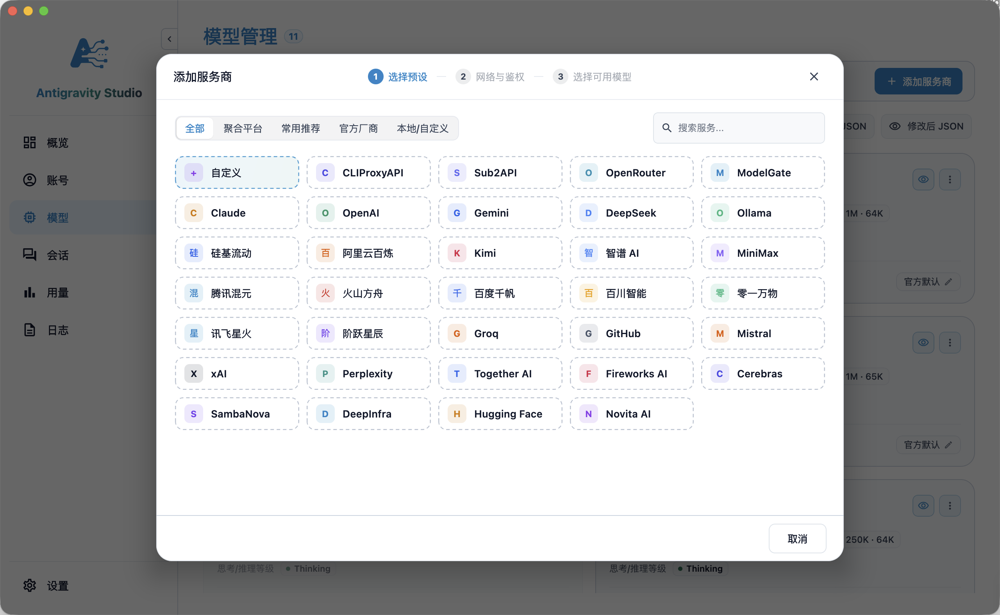

### 3. 跨端智能体会话管理与 AI 智能起名
- **全生态会话统一归集**：集中索引并浏览来自 Antigravity 2.0（独立桌面端）、Antigravity IDE、Antigravity CLI 及 VS Code 插件的全部智能体会话与交互轨迹。
- **多维过滤与工程检索**：支持按工程项目、客户端来源过滤，支持搜索标题、会话 ID 或关键字；清晰展示会话交互步数（如 136 步）与数据体积（如 11.1 MB）。
- **AI 会话智能起名 (AI Renaming)**：支持手动重命名，更可一键召唤 AI（如 Gemini 3.8 Flash）阅读整场对话的上下文，自动总结并生成凝练精准的任务标题。
- **快捷交互与操作**：支持一键在 Finder / 资源管理器中打开工程目录、复制会话 ID、在独立窗口重温会话，或安全清理废弃历史。

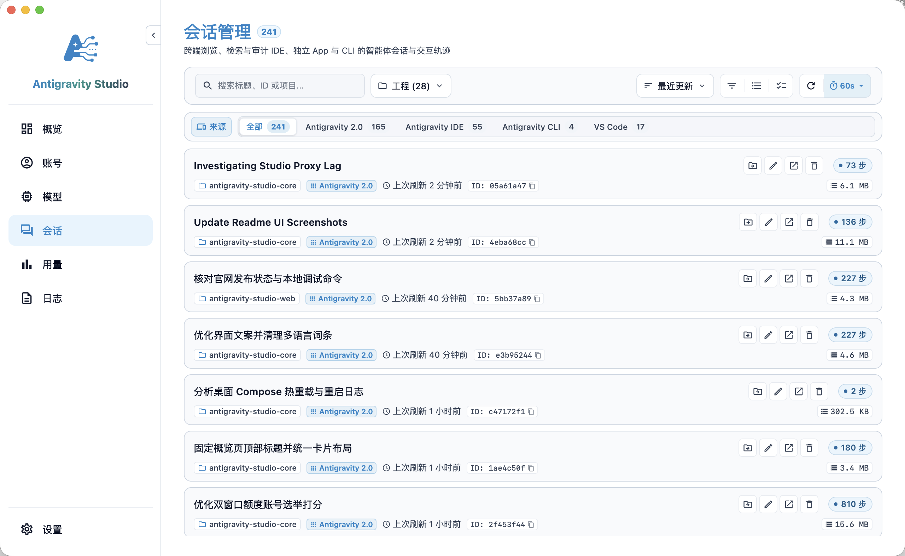
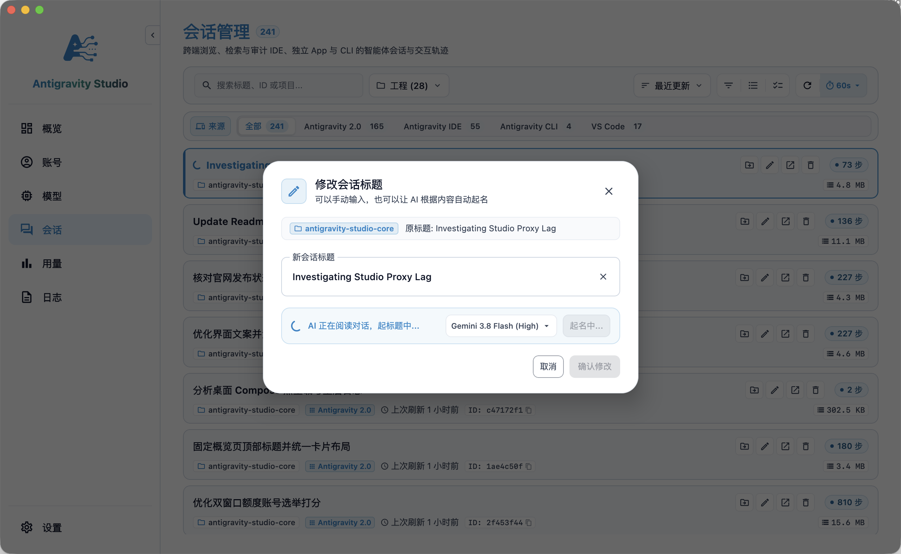

### 4. 一键代理接管与多宿主状态感知
- **多宿主状态感知**：自动识别本机 Antigravity 2.0、Antigravity IDE、Antigravity CLI 以及 VS Code 插件的安装路径、版本号与当前运行状态。
- **独立代理模式开关**：无需繁琐的命令行配置，在概览页面一键拨动各客户端的代理开关，即开即用；CLI 提供一键复制接入启动命令。
- **进程安全治理**：支持在界面上一键刷新状态、关闭或安全重启宿主实例；随时可一键还原为官方直连，不修改任何官方安装包与二进制文件。

### 5. 系统健康诊断与故障自愈 (Doctor)
- **全链路健康巡检**：一键检测本地代理服务监听状态、Google 官方 Cloud Code 服务连通性与网络时延、第三方模型服务商鉴权与可用模型状态。
- **宿主接入诊断与一键修复**：智能识别各 Antigravity 宿主应用是否已接入代理；对于直连官方的应用提供「一键接入」引导，秒级自愈。

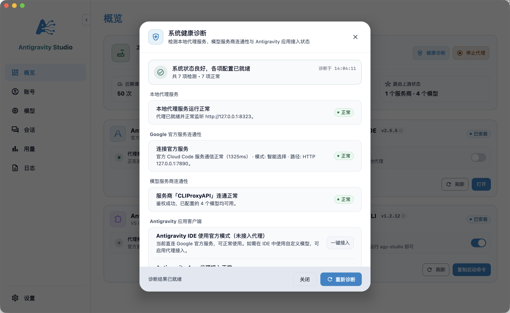

### 6. Token 用量统计与消耗大盘
- **多维度用量分析**：支持按今天、1天、7天、14天、30天及自定义日期范围，统计总 Token 消耗、API 调用次数、预估总花费（美元及人民币折算）。
- **精准吞吐拆解**：清晰区分普通输入 Token、内容生成输出、思考/推理 Token，以及服务端 Prompt 缓存命中率与读取量（如 92.3% 缓存率）。
- **平滑趋势分析**：可视化呈现每日 Token 消耗走势波形图与峰值点，助你轻松掌握模型使用规律。

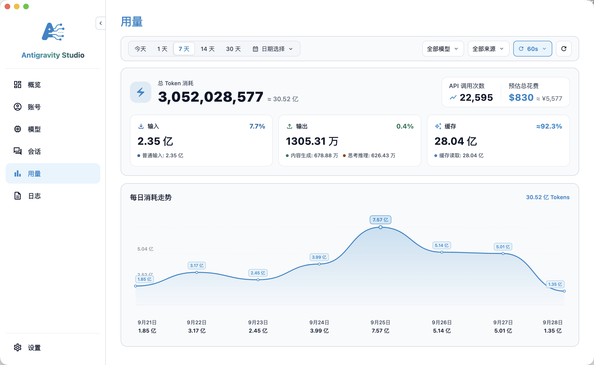

### 7. 调用日志审计与端到端性能度量
- **单调时钟性能度量**：基于单调时钟计算真实的端到端吞吐 (E2E TPS)、首字延迟 (TTFT)、排队耗时与单 Token 生成速度 (TPOT)。
- **双栏常驻详情与 cURL 调试**：宽屏下支持右侧常驻并排展示请求详情与指标流；支持一键复制格式化且带转义的终端 cURL 命令。
- **Agent 任务全感知**：识别上下文压缩、终端检测、标题生成、BYOK 工具调用等任务类型并打上专属标签，自动补齐思考 Token 统计。
- **本地持久化与冷热分层**：基于 AndroidX Room KMP 与 SQLite 本地引擎存储日志，冷热分层分页加载；数据完全保存在本机，支持自定义 1 至 30 天保留期或一键清空。

### 8. 应用偏好与个性化配置
- **语言与外观模式**：支持简体中文 / English 界面语言无缝切换；支持浅色、深色模式及跟随系统。
- **Material Design 3 八大主题色系**：提供「白曜极简」、「赤霞绯红」、「橙光落日」、「黄昏金珀」、「绿岚翡翠」、「青碧苍黛」、「蓝海清冽」、「紫霞晨光」精选主题配色。
- **AI 智能起名模型定制**：支持自由指定 AI 智能提炼会话标题时优先使用的模型（如 `gemini-3.8-flash-high`）。
- **切号与宿主路径偏好**：自定义切号时的默认目标应用预设，以及自定义各宿主应用的安装目录与可执行文件路径。

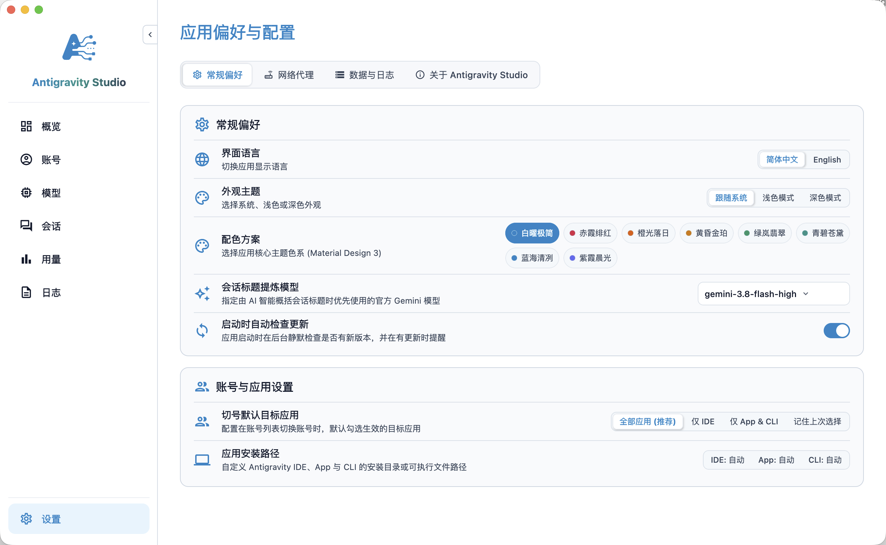

---

## 工作原理

```text
Antigravity 2.0 / IDE / CLI / VS Code
            │
            ▼ (请求发送至本地代理)
    http://127.0.0.1:8321 (默认端口)
            │
            ├─► 官方模型请求 (Gemini / Claude)
            │         │
            │         ▼
            │    ┌───────────────────────────────────────────────┐
            │    │            账号池智能调度引擎                 │
            │    │ ┌───────────────────────────────────────────┐ │
            │    │ │ 策略选择器: 智能接力 / 会话隔离 / 负载均衡 │ │
            │    │ ├───────────────────────────────────────────┤ │
            │    │ │ 紧迫度评分: 剩余额度 ÷ 距重置时间 (临期冲刺)│ │
            │    │ ├───────────────────────────────────────────┤ │
            │    │ │ 容灾与避障: 429 冷却隔离 / Claude 状态探测│ │
            │    │ └───────────────────────────────────────────┘ │
            │    └───────────────────────┬───────────────────────┘
            │                            │
            │                            ▼ (按账号独立出网代理分别路由)
            │                     Google 官方服务器
            │
            └─► 自定义模型请求 (BYOK)
                      │
                      ▼ (本地协议转换、思维链与工具调用适配)
            OpenAI / Anthropic / DeepSeek / Ollama 等
```

---

## 桌面端与 IDE 插件配合推荐

| 产品 | 定位与核心场景 |
| :--- | :--- |
| **Antigravity Studio（桌面端）** | **账号池调度、第三方模型接入与代理接管**<br>适合用于管理多账号配额与智能调度策略、独立出网代理、自带 Key 接入第三方大模型（云端/本地）、调整长上下文压缩阈值，以及统一接管 IDE / App / CLI / VS Code。 |
| **[Antigravity IDE Cockpit（IDE 插件）](https://open-vsx.org/extension/yuzhiqiang/antigravity-ide-cockpit)** | **IDE 内无感切号与会话上下文洞察**<br>运行在 Antigravity IDE 内部，支持更细致的无感切号、实时会话 Token 消耗分析与脱敏诊断。 |

> 💡 **使用建议**：推荐由 **Studio 桌面端** 负责账号池调度与自定义模型的代理注入，由 **Cockpit 插件** 在 IDE 内负责无感切号与上下文用量追踪，两者配合使用体验更佳。

👉 [在 Open VSX 安装 Cockpit 插件](https://open-vsx.org/extension/yuzhiqiang/antigravity-ide-cockpit) · [访问官网 agycockpit.com](https://agycockpit.com)

---

## 安装与下载

### 1. 下载预编译安装包 (推荐)

前往 [GitHub Releases](https://github.com/yuzhiqiang1993/antigravity-studio/releases/latest) 下载对应平台的安装包：

| 操作系统与平台 | 推荐安装包 | 说明 |
| :--- | :--- | :--- |
| **macOS (Apple Silicon)** | `Antigravity-Studio-x.x.x-macos-arm64.dmg` | 适用于 M1 / M2 / M3 / M4 等 M 系列芯片 Mac |
| **macOS (Intel)** | `Antigravity-Studio-x.x.x-macos-x64.dmg` | 适用于 Intel 处理器 Mac |
| **Windows (x64)** | `Antigravity-Studio-x.x.x-windows-x64.exe` | 适用于 64 位 Windows 10 / 11 |

> 💡 **macOS 首次打开提示“已损坏”或“无法打开”？**
> 这是 macOS Gatekeeper 对未签名开源应用的拦截。打开系统「终端」，执行以下命令即可：
> ```bash
> sudo xattr -rd com.apple.quarantine "/Applications/Antigravity Studio.app"
> ```

---

### 2. 快速上手 3 步走

1. **配置账号池或第三方模型**：
   - **使用官方模型**：在侧边栏进入「**账号**」页面录入或导入多个 Google 账号，开启「**账号池调度**」并按需选择策略（如“智能接力★”或“会话隔离”）；
   - **使用第三方模型**：在「**模型**」页面点击「**添加服务商**」，从预设列表快速选择（如 DeepSeek、OpenAI、Claude、Ollama 等），填入 API Key 并勾选想要启用的模型。
2. **开启代理接管**：进入「**概览**」页面，在对应的客户端卡片（如 Antigravity 2.0、Antigravity IDE、VS Code 插件）上直接开启「**代理模式**」开关；如使用终端 CLI，可一键复制接入启动命令。
3. **开始使用**：重新打开或直接使用 Antigravity 宿主应用，在模型选择列表中即可选用注入的新模型；调用官方模型时，本地代理会在后台根据账号池策略全自动健康调度与智能接力。还可在「**会话**」页面统一归集与审计跨端对话轨迹。

---

## 常见问题 FAQ

**Q: 开启账号池调度后，写代码中途换号会打断正在进行的会话吗？**
- 不会。如果选择「会话隔离」策略，已有会话会一直锁定原账号以复用上下文缓存；如果选择「智能接力」，仅在主号遇到 429 或配额见底时由备用号在后台接棒，过程对编辑器透明，不会打断编码流程。

**Q: 为什么推荐“临期冲刺”？会不会导致某些号过快用完？**
- Google 官方配额是周期性刷新的，到期未用完的额度会被清零作废。临期冲刺算法优先消耗距离重置最近、额度最多的账号，目的是赶在官方刷新前把即将作废的配额用满，从而最大化整体可用的 Token 总量。

**Q: 每个账号可以配置不同的代理吗？**
- 可以。在账号卡片上可以为每个账号单独配置 HTTP 或 SOCKS5 出网代理，避免多个账号使用同一个出口 IP 导致连带风控。

**Q: 开启接管后，IDE 里的模型列表没出现新模型？**
- 确认「模型管理」中已成功添加服务商并勾选了模型；
- 确认「运行概览」中代理服务正在运行，且对应 IDE 状态显示为“已接入”；
- 重启一次 Antigravity IDE 使其重新读取配置。

**Q: 恢复官方直连会清空我添加的配置吗？**
- 不会。恢复直连只是把 IDE / App 的网络指向还原回官方，添加的账号、服务商、Key、模型和各项设置都会完整保留在本地。

**Q: 我的 API Key、账号凭据和代码安全吗？**
- 安全。Antigravity Studio 是 100% 纯本地运行的开源软件，没有外部云端服务器，所有配置保存在本地电脑，网络请求直接发送至对应模型服务商或官方服务器。

---

## 交流与反馈

欢迎加入社区交流大本营，与其他开发者交流配置心得、反馈问题与获取新版本动态：

- **QQ 交流群**：`613214996`（推荐，答疑与日常交流大本营）
- **Bug 反馈与建议**：欢迎提交 [GitHub Issues](https://github.com/yuzhiqiang1993/antigravity-studio/issues)

---

## 软件许可与免责声明

- **软件许可**：Antigravity Studio 分发产物免费提供给个人及团队使用，遵循 [MIT License](LICENSE)。
- **免责声明与风险提示**：
  - Antigravity Studio 为独立的第三方桌面辅助工具，与 Google 或 Antigravity 官方团队无任何关联，请在使用时遵守各服务商的使用规范。
  - Google 官方的风控策略与配额规则处于不定期动态调整中，任何人均无法预知或保证其策略变化。使用本工具产生的任何后果（包括但不限于账号限流、异常标记、封禁或配额扣减等）均由使用者自行承担，与本项目及开发者无任何关系。
  - **如果你担心对自己的个人或工作账号产生任何潜在影响，请勿使用本工具。**
